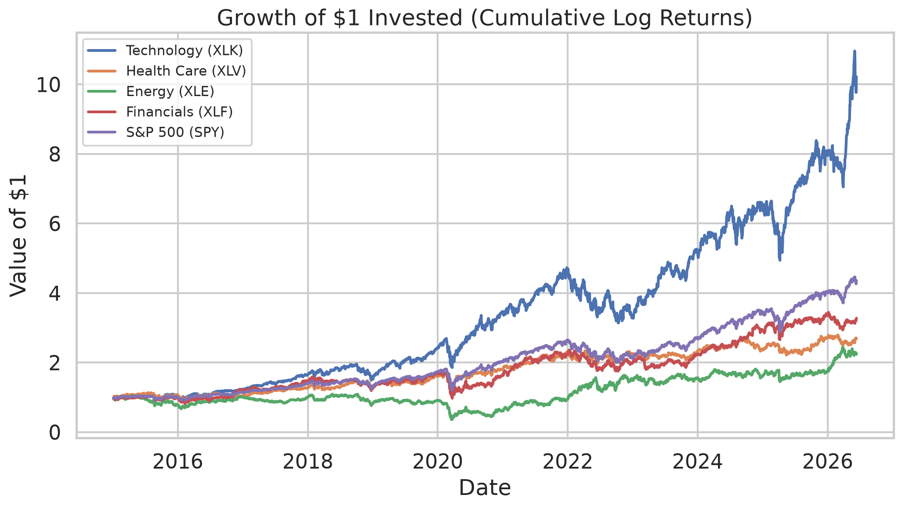
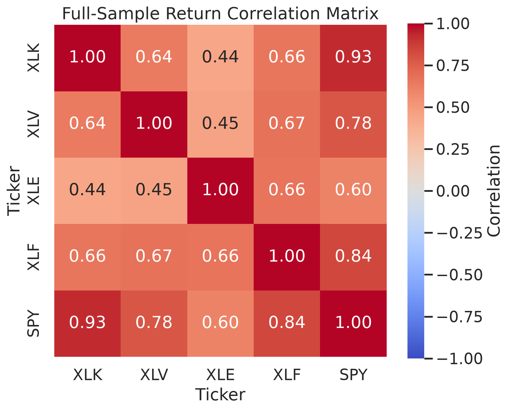
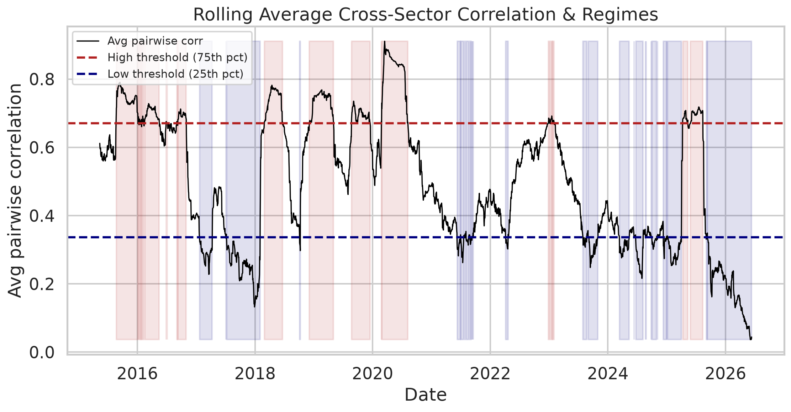
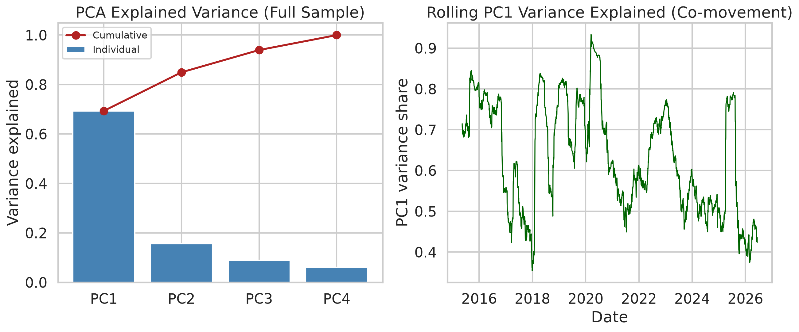
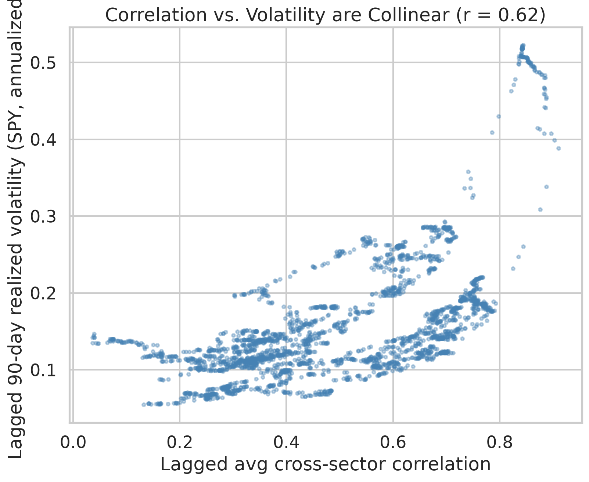
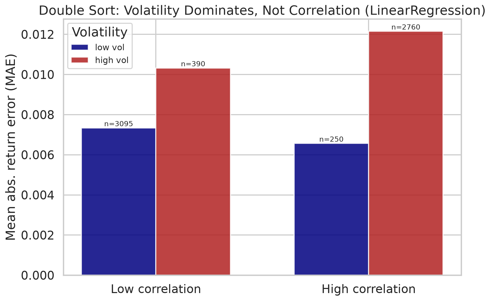
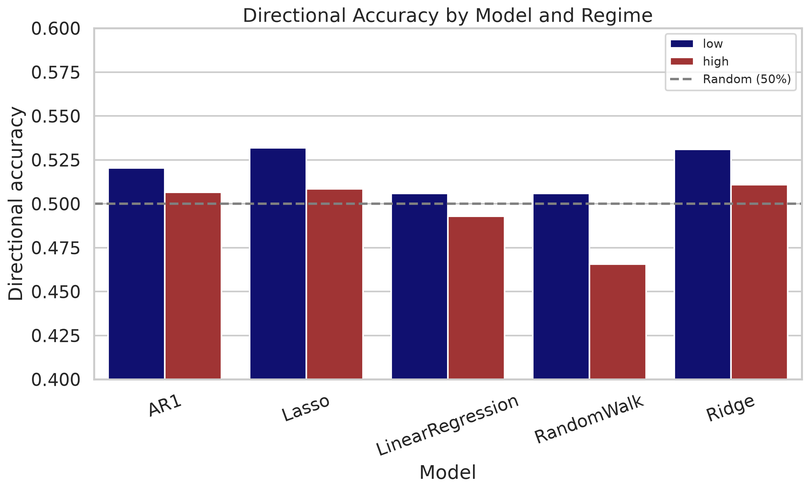

# Cross-Sector Correlation Regimes and Their Impact on the Predictive Accuracy of Equity Price Forecasting Models

**A quantitative study of U.S. sector ETFs (2015–2026)**

---

## Abstract

This study tests whether the accuracy of one-day-ahead equity forecasts depends on the cross-sector correlation regime, and whether any such dependence holds once market volatility is controlled for. It uses daily data from January 2015 to June 2026 for four S&P 500 sector ETFs (technology, health care, energy, financials) and SPY. A 90-day rolling average of the pairwise sector correlations defines high, low, and mid regimes by quartile. Five walk-forward models are tested: a random walk, an AR(1), a linear regression on five lagged returns, and Ridge and Lasso versions of that regression. Absolute return errors are 58 to 62 percent larger in the high-correlation regime, and both a t-test and a Mann–Whitney test reject equal accuracy across regimes (p < 0.001 for every model). Correlation and volatility move together in the sample, with a correlation of 0.64. When forecast error is regressed on lagged correlation and lagged volatility together, the correlation term is not significant (p = 0.72 to 0.79) while volatility is (p ≈ 6×10⁻⁶), and the fit does not improve when correlation is added. Directional accuracy stays between 45 and 54 percent in every regime. The regime result is a volatility effect, not a correlation effect.

---

## Introduction

Market structure is not fixed. Correlations, volatility, and return behavior shift over time, and one common way to describe this is through regimes (Hamilton, 1989). Cross-asset correlation is one such regime variable. In calm markets, sectors are driven mostly by their own news; in stressed markets, a single systematic factor dominates and sectors move together (Ang and Bekaert, 2002; Ang and Chen, 2002).

Short-horizon equity returns are hard to predict to begin with. Welch and Goyal (2008) find that standard predictors rarely beat the historical mean out of sample, and Campbell and Thompson (2008) find that detectable predictability produces only small out-of-sample gains. Combining predictors can add modest out-of-sample value (Rapach, Strauss, and Zhou, 2010), but the baseline is low, and any regime-conditional result has to be read against it.

The starting idea is a signal-to-noise argument. Linear forecasting models rely on weak sector-specific structure, such as mild autocorrelation and lead–lag effects between sectors. When correlation is low, that structure is visible. When correlation is high, one factor dominates the cross-section and the sector-specific part of returns shrinks. So models should forecast less accurately when cross-sector correlation is high.

This study tests that prediction and then checks it against a confound. High correlation tends to occur when volatility is high, and Forbes and Rigobon (2002) show that estimated correlations are themselves inflated during high-volatility periods. A result that "accuracy is worse in high-correlation regimes" could simply mean "accuracy is worse when moves are large." The question is therefore narrower: does the correlation regime say anything about forecast accuracy beyond what volatility already explains? In this sample, it does not.

---

## Data

The data are daily adjusted-close prices from Yahoo Finance for 2 January 2015 to 12 June 2026, which is 2,878 trading days. Adjusted close accounts for splits and dividends. The universe is four sector ETFs and the broad market:

| Ticker | Sector | Economic character | Role |
|--------|--------|--------------------|------|
| XLK | Technology | Secular growth, long-duration | Sector |
| XLV | Health care | Defensive growth | Sector |
| XLE | Energy | Inflation and commodity sensitive | Sector |
| XLF | Financials | Rate sensitive, cyclical | Sector |
| SPY | S&P 500 | Broad market | Market and target |

The four sectors respond to different drivers, so their pairwise correlations vary over the cycle. Prices are aligned on common trading dates, short internal gaps are forward-filled, and any remaining missing rows are dropped. Prices are converted to log returns:

$$ r_t = \ln\!\left(\frac{P_t}{P_{t-1}}\right). $$

Technology was the strongest sector over the period and energy the weakest. All five series have negative skew and heavy tails, which are standard features of equity returns (Cont, 2001).

| Asset | Annual return | Annual volatility | Sharpe | Skew | Excess kurtosis |
|-------|--------------:|------------------:|-------:|-----:|----------------:|
| XLK | 20.4% | 23.9% | 0.85 | −0.32 | 9.3 |
| XLV | 8.7% | 16.8% | 0.52 | −0.39 | 8.7 |
| XLE | 7.1% | 29.4% | 0.24 | −0.87 | 15.6 |
| XLF | 10.4% | 21.8% | 0.48 | −0.56 | 15.1 |
| SPY | 12.9% | 17.7% | 0.73 | −0.58 | 14.5 |

---

## Methods

### Correlation and regimes

For each day, the Pearson correlation between every pair of the four sector ETFs is estimated over a trailing 90-day window. There are six pairs, and their mean is the day's average pairwise correlation. The full-sample correlations are shown in Figure 2.

Each day is labeled by quartile of the average correlation: high if at or above the 75th percentile (0.670), low if at or below the 25th percentile (0.337), and mid otherwise. This gives 697 high days, 697 low days, and 1,394 mid days. High-correlation periods line up with known stress episodes, including the 2018 volatility spike, the 2020 COVID crash, and the 2022 drawdown (Figure 3).

As a check on co-movement, PCA is run on the standardized sector returns. The first principal component explains 69.3 percent of the variance, and the first two explain 85.0 percent (Figure 4). A single factor accounts for most of the joint variation.

### Forecasting models

All forecasts are one step ahead and out of sample. For each day the model is fit only on data through the previous day, using a 252-day rolling window. The rolling correlation, the training window, and the regime thresholds all use data through the previous day, so nothing from day t enters the forecast for day t.

| Model | Specification |
|-------|---------------|
| Random walk | Predicted return is zero, so the price forecast equals the previous close; naive direction is the sign of the previous return |
| AR(1) | Return on one lag |
| Linear regression | Return on lags 1 through 5 |
| Ridge | Linear regression with an L2 penalty, α = 1.0 |
| Lasso | Linear regression with an L1 penalty, α = 5×10⁻⁴ |

The random walk is a hard benchmark; beating a no-change forecast out of sample is difficult for short-horizon returns (Campbell and Thompson, 2008). Ridge and Lasso are standard linear benchmarks in this setting, where shrinkage methods are evaluated alongside nonlinear ones that can do better (Gu, Kelly, and Xiu, 2020). The penalties are fixed at conventional defaults rather than tuned, because the sample starts in January 2015 and there is no earlier period to tune on without look-ahead. A penalty grid is reported below.

### Evaluation

For each model and regime, mean absolute error (MAE) and root mean squared error (RMSE) are computed for both the return forecast and the price forecast, along with directional accuracy, which is the share of days on which the predicted return sign matches the realized sign. Days with zero realized return are dropped from the directional count.

Return MAE is the main scale for comparing regimes, because price levels drift and a price MAE would mix forecasting difficulty with the price level. One caution shapes the rest of the analysis. Because every model predicts a return near zero, the absolute return error is close to the size of the realized move, which tracks realized volatility. Volatility clusters and persists (Engle, 1982; Bollerslev, 1986), so return MAE is not independent of volatility. Directional accuracy is the metric that does not scale with move size; getting the sign right is no easier when moves are large.

### Volatility control

To separate a correlation effect from a volatility effect, a volatility proxy is added: the 90-day annualized realized volatility of SPY, computed through the previous day (Andersen, Bollerslev, Diebold, and Labys, 2003). The daily mean absolute error is regressed on the lagged correlation and the lagged volatility, each standardized, with Newey and West (1987) standard errors at 21 lags:

$$ |\text{error}|_t = b_0 + b_1\,\text{corr}_{t-1} + b_2\,\text{vol}_{t-1} + e_t. $$

Three versions are estimated: correlation only, volatility only, and both. A 2×2 sort on the lagged correlation quartiles and a lagged-volatility median split is also reported, so error can be read with volatility held roughly fixed.

---

## Results

### Accuracy by regime

Return errors are larger and directional accuracy is lower in the high-correlation regime for every model. The naive direction from the random walk is 46.6 percent in the high regime, below a coin flip.

| Model | Regime | MAE (return) | RMSE (return) | Directional accuracy |
|-------|--------|-------------:|--------------:|---------------------:|
| Random walk | high | 0.01162 | 0.01924 | 46.6% |
| Random walk | low | 0.00734 | 0.01009 | 50.6% |
| AR(1) | high | 0.01157 | 0.01915 | 50.6% |
| AR(1) | low | 0.00734 | 0.01013 | 52.0% |
| Linear regression | high | 0.01209 | 0.02032 | 49.3% |
| Linear regression | low | 0.00746 | 0.01027 | 50.6% |
| Ridge | high | 0.01162 | 0.01925 | 51.1% |
| Ridge | low | 0.00732 | 0.01012 | 53.1% |
| Lasso | high | 0.01163 | 0.01928 | 50.9% |
| Lasso | low | 0.00732 | 0.01011 | 53.2% |

Return errors are 58 to 62 percent larger in the high regime across the five models.

### Regime tests

For each model, absolute return errors in the high and low regimes are compared with a Welch t-test and a Mann–Whitney U test; comparing the accuracy of competing forecasts is the problem set out by Diebold and Mariano (1995). Directional accuracy is compared with a two-proportion z-test, in the spirit of the sign test of Pesaran and Timmermann (1992). The paired observations are not independent, since regimes persist and the assets are correlated, so the very small p-values overstate certainty. The regression below uses HAC standard errors and is the more reliable test.

| Model | Mean \|err\| high | Mean \|err\| low | t-test p | Mann–Whitney p | Cohen's d |
|-------|------------------:|-----------------:|---------:|---------------:|----------:|
| Random walk | 0.01162 | 0.00734 | 2.3×10⁻⁴⁴ | 2.0×10⁻²⁹ | 0.37 |
| AR(1) | 0.01157 | 0.00734 | 1.2×10⁻⁴³ | 3.0×10⁻²⁸ | 0.37 |
| Linear regression | 0.01209 | 0.00746 | 3.4×10⁻⁴⁶ | 4.5×10⁻³³ | 0.38 |
| Ridge | 0.01162 | 0.00732 | 2.1×10⁻⁴⁴ | 4.0×10⁻³⁰ | 0.37 |
| Lasso | 0.01163 | 0.00732 | 1.1×10⁻⁴⁴ | 1.8×10⁻³⁰ | 0.37 |

Both tests reject equal accuracy for every model, with a small-to-medium effect size. On its own this says accuracy depends on the regime.

### Correlation versus volatility

Lagged correlation and lagged volatility are correlated at 0.64 in the sample (Figure 5). The regression of daily mean absolute error on the two lagged predictors settles the question. The linear-regression model is shown; the other models give the same pattern (n = 2,620).

| Specification | b (correlation) | p (corr) | b (volatility) | p (vol) | R² |
|---------------|----------------:|---------:|---------------:|--------:|---:|
| Correlation only | +0.00190 | 0.017 | — | — | 0.045 |
| Volatility only | — | — | +0.00309 | 5.3×10⁻⁵ | 0.119 |
| Both | −0.00015 | 0.794 | +0.00319 | 6.0×10⁻⁶ | 0.119 |

Correlation is significant on its own but drops to zero and loses significance once volatility is added, with a joint p between 0.72 and 0.79 across the five models. Volatility stays significant, with a joint p near 6×10⁻⁶. Adding correlation on top of volatility does not change the fit; R² is 0.119 either way, and ranges from 0.109 to 0.119 across models. Once volatility is in the regression, the correlation regime adds nothing to the error magnitude. The dependent variable here is still return error, which tracks move size, so the surviving volatility term is partly mechanical and should not be read as volatility predicting skill. Directional accuracy is tested below.

### Double sort

The 2×2 sort shows the same thing with volatility held roughly fixed. Cells use the correlation quartile thresholds (0.337 and 0.670) and the lagged-volatility median (0.137). The linear-regression model is shown.

| | Low volatility | High volatility |
|---|---:|---:|
| Low correlation | MAE 0.00734 (n = 3,095) | MAE 0.01032 (n = 390) |
| High correlation | MAE 0.00657 (n = 250) | MAE 0.01216 (n = 2,760) |

Moving from low to high volatility raises MAE within each correlation row, by 41 percent in the low row and 85 percent in the high row. Holding volatility fixed, correlation does not have a consistent effect: in the low-volatility row, high correlation has a lower MAE than low correlation, while in the high-volatility row it has a higher MAE. The two off-diagonal cells are small, at 250 and 390 days, because correlation and volatility move together, so those means are noisier (Figure 6).

### Directional accuracy

Return MAE tracks move size, so the test that does not is whether the models get the direction right in any regime. The 2×2 directional accuracy for all five models is:

| Model | Low corr, low vol | Low corr, high vol | High corr, low vol | High corr, high vol |
|-------|-----:|-----:|-----:|-----:|
| Random walk | 51.7% | 45.2% | 45.5% | 46.8% |
| AR(1) | 52.2% | 53.0% | 52.8% | 50.5% |
| Linear regression | 51.1% | 48.8% | 50.8% | 48.7% |
| Ridge | 53.3% | 53.0% | 48.4% | 51.7% |
| Lasso | 53.5% | 52.4% | 48.4% | 51.4% |

Every value is between 45 and 54 percent. No model has a clear edge in any cell, and the random walk direction is below 50 percent in three of four cells. The volatility ordering from the MAE tables does not carry over: for Ridge and Lasso the worst cell is high correlation with low volatility, and AR(1) is flat. Because correlation and volatility move together, their marginal orderings coincide and are small, about 1 to 5 percentage points, and the metric cannot assign the difference to one or the other. On a metric that does not scale with volatility, there is little sign skill to attribute in any regime (Figure 7).

### Penalty robustness

To check that the Ridge and Lasso results do not depend on the chosen penalty, both were rerun on SPY across a penalty grid. The ratio of high-regime to low-regime MAE is flat.

| Model | α values | High/low MAE ratio |
|-------|----------|--------------------|
| Ridge | 0.1, 1.0, 10.0 | 1.70, 1.71, 1.72 |
| Lasso | 1×10⁻⁴, 5×10⁻⁴, 1×10⁻³ | 1.71, 1.72, 1.72 |

The regime gap does not depend on the penalty. These ratios are for SPY alone, so they differ in level from the pooled five-asset figures.

---

## Discussion

Two statements hold at once. On error size, the correlation effect is a volatility effect. Errors are about 60 percent larger in the high-correlation regime, but the effect disappears once volatility is controlled with a lagged proxy, and the double sort shows the correlation effect changing sign across volatility levels. This matches Forbes and Rigobon (2002): measured correlation rises with volatility, so a correlation-regime effect can be a volatility effect. Their work was on cross-country contagion; the same bias is applied here to a cross-sector, forecasting setting.

The volatility side should not be overstated either. The surviving volatility term is measured on return error, and since the forecasts are near zero, that error is close to move size, so the link is partly mechanical. This is why the analysis relies on directional accuracy, which does not scale with move size. On that metric, accuracy is between 45 and 54 percent in every cell, and neither correlation nor volatility produces a clean ordering. There is little short-horizon sign skill in any regime, which is consistent with the out-of-sample predictability literature (Welch and Goyal, 2008; Campbell and Thompson, 2008).

The usable point is narrow. Volatility, observable the day before, tracks how large errors will be, and correlation adds nothing beyond it. Large errors are not the same as lost skill, and on a scale-free basis the models are near a coin flip in every regime. A single headline accuracy number is misleading, but the variable that matters for error size is volatility, not correlation.

### Limitations

Correlation and volatility cannot be fully separated in this sample, since they move together and the cells that would separate them are the smallest. One volatility proxy is used; a different proxy such as VIX or a GARCH estimate could shift the coefficients but is unlikely to reverse the sign of the result. The models are linear and short-horizon; nonlinear models could behave differently, though they face the same noisy data. The sample is U.S. equity ETFs from 2015 to 2026. The regime-test p-values overstate certainty because the observations overlap; the HAC regression is the reliable test.

---

## Conclusion

A correlation-regime effect that looks strong turns out to be a volatility effect. Return errors are 58 to 62 percent larger in the high-correlation regime, with p < 0.001 across five models and two tests, but the effect does not survive a lagged volatility control: the correlation term drops to zero and loses significance while volatility stays significant. On directional accuracy, which does not scale with move size, the models are near a coin flip in every regime. The result generalizes to other regime studies. When a variable such as correlation is sorted on, it can stand in for volatility, and a small p-value on an error metric does not separate the two. The check is to add a lagged volatility control and to test on a metric that move size cannot inflate. Here, both remove the effect.

---

## References

Andersen, T. G., T. Bollerslev, F. X. Diebold, and P. Labys. 2003. "Modeling and Forecasting Realized Volatility." *Econometrica* 71 (2): 579–625. https://doi.org/10.1111/1468-0262.00418

Ang, A., and G. Bekaert. 2002. "International Asset Allocation With Regime Shifts." *The Review of Financial Studies* 15 (4): 1137–1187. https://doi.org/10.1093/rfs/15.4.1137

Ang, A., and J. Chen. 2002. "Asymmetric Correlations of Equity Portfolios." *Journal of Financial Economics* 63 (3): 443–494. https://doi.org/10.1016/S0304-405X(02)00068-5

Bollerslev, T. 1986. "Generalized Autoregressive Conditional Heteroskedasticity." *Journal of Econometrics* 31 (3): 307–327. https://doi.org/10.1016/0304-4076(86)90063-1

Campbell, J. Y., and S. B. Thompson. 2008. "Predicting Excess Stock Returns Out of Sample: Can Anything Beat the Historical Average?" *The Review of Financial Studies* 21 (4): 1509–1531. https://doi.org/10.1093/rfs/hhm055

Cont, R. 2001. "Empirical Properties of Asset Returns: Stylized Facts and Statistical Issues." *Quantitative Finance* 1 (2): 223–236. https://doi.org/10.1088/1469-7688/1/2/304

Diebold, F. X., and R. S. Mariano. 1995. "Comparing Predictive Accuracy." *Journal of Business & Economic Statistics* 13 (3): 253–263. https://doi.org/10.1080/07350015.1995.10524599

Engle, R. F. 1982. "Autoregressive Conditional Heteroscedasticity with Estimates of the Variance of United Kingdom Inflation." *Econometrica* 50 (4): 987–1008. https://doi.org/10.2307/1912773

Forbes, K. J., and R. Rigobon. 2002. "No Contagion, Only Interdependence: Measuring Stock Market Comovements." *The Journal of Finance* 57 (5): 2223–2261. https://doi.org/10.1111/0022-1082.00494

Gu, S., B. Kelly, and D. Xiu. 2020. "Empirical Asset Pricing via Machine Learning." *The Review of Financial Studies* 33 (5): 2223–2273. https://doi.org/10.1093/rfs/hhaa009

Hamilton, J. D. 1989. "A New Approach to the Economic Analysis of Nonstationary Time Series and the Business Cycle." *Econometrica* 57 (2): 357–384. https://doi.org/10.2307/1912559

Newey, W. K., and K. D. West. 1987. "A Simple, Positive Semi-Definite, Heteroskedasticity and Autocorrelation Consistent Covariance Matrix." *Econometrica* 55 (3): 703–708. https://doi.org/10.2307/1913610

Pesaran, M. H., and A. Timmermann. 1992. "A Simple Nonparametric Test of Predictive Performance." *Journal of Business & Economic Statistics* 10 (4): 461–465. https://doi.org/10.1080/07350015.1992.10509922

Rapach, D. E., J. K. Strauss, and G. Zhou. 2010. "Out-of-Sample Equity Premium Prediction: Combination Forecasts and Links to the Real Economy." *The Review of Financial Studies* 23 (2): 821–862. https://doi.org/10.1093/rfs/hhp063

Welch, I., and A. Goyal. 2008. "A Comprehensive Look at the Empirical Performance of Equity Premium Prediction." *The Review of Financial Studies* 21 (4): 1455–1508. https://doi.org/10.1093/rfs/hhm014

---

## Data and code

The data, code, and figures are available at github.com/zikobob/stock-research. The full analysis reproduces from `python -m src.main` and `python -m src.confound_analysis`. Parameters are set in `src/config.py`.
