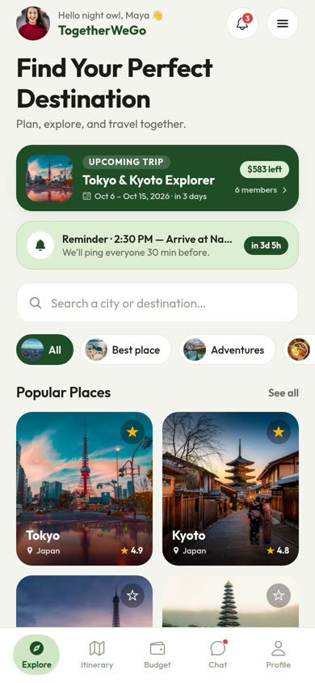
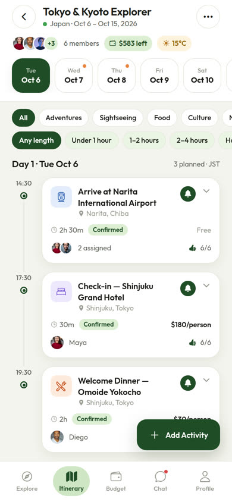
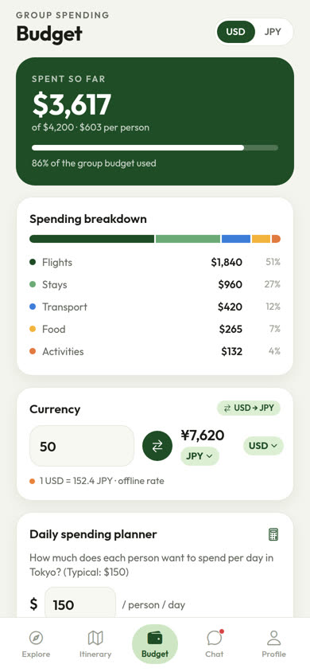
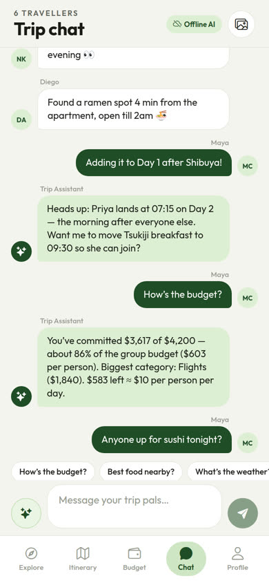
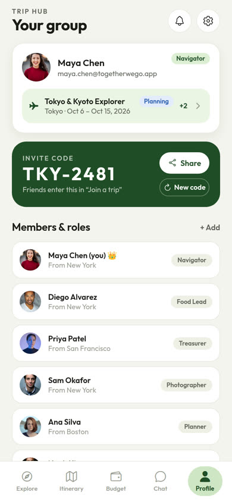

# TogetherWeGo ✈️ — Group Trip Planner

**FBLA Mobile Application Development 2026–27 · Topic: “Together We Go: Group Trip Planner”**

TogetherWeGo helps a group of friends or family plan, budget and enjoy a shared trip — from the first idea, through the trip itself, to the final recap. It runs natively on **iPhone and Android** (Expo / React Native, TypeScript) and keeps working **offline**, which matters at a conference venue with unreliable wifi.

<p>





</p>

---

## 1. Run it on your phone (5 minutes)

**You need:** a laptop with [Node.js 20+](https://nodejs.org), and the free **Expo Go** app on your phone ([iOS](https://apps.apple.com/app/expo-go/id982107779) · [Android](https://play.google.com/store/apps/details?id=host.exp.exponent)). Make sure Expo Go is up to date — this project uses **Expo SDK 57**.

```bash
cd together-we-go
npm install
npx expo start            # same wifi for phone + laptop
# or, on school / conference wifi that blocks devices from seeing each other:
npx expo start --tunnel
```

Scan the QR code (iPhone: Camera app · Android: Expo Go → *Scan QR code*).

**Demo login** (also shown on the sign-in screen — tap the box to fill it in):

| Email | Password |
|---|---|
| `maya.chen@togetherwego.app` | `TravelTogether2026!` |

The sample trip is generated **relative to today**, so “Tokyo & Kyoto Explorer” always starts in 3 days. *Settings → Demo timeline* rebuilds it as **upcoming**, **in progress (Day 2)** or **just finished** to show every stage.

### For the competition: run with zero internet
Expo Go needs the laptop’s dev server. For a fully standalone app, build an installable copy with EAS (free account):

```bash
npx eas-cli@latest build -p android --profile preview   # gives you an .apk to install
```

(iOS standalone builds need an Apple Developer account; Expo Go over a phone hotspot also works without venue wifi.)
Once installed, everything except live weather, live exchange rates, maps tiles and the optional Claude AI works offline — and those fall back to cached/estimated data automatically.

Other scripts: `npm run web` (browser preview), `npx tsc --noEmit` (type-check), `npx expo lint`.

---

## 2. What it does — mapped to the brief

| Brief area | Feature in TogetherWeGo | Where |
|---|---|---|
| **Collaboration** | Trips with auto-generated invite codes (`TKY-2481`), join by code or deep link | Profile → Invite code · *Join a trip* |
| | Roles: Organizer, Treasurer, Navigator, Food Lead, Photographer… with descriptions | Profile → Members & roles |
| | Shared checklist with assignees | Profile → Checklist |
| | Voting: 👍/👎 on activities (majority auto-confirms) + multi-option polls | Itinerary card · Profile → Vote |
| **Communication** | Group trip chat with typing indicators | Chat tab |
| | **Trip Assistant (AI chatbot)** — answers from live trip data: budget, who owes who, weather, food nearby, next activity, flights, time zones, currency, phrases, emergencies. Works offline; optional Claude mode with your own key | Chat tab (✨ button or quick chips) |
| **Scheduling** | Day-by-day itinerary/calendar with timeline, status pills, assignees | Itinerary tab |
| | Members upload flight tickets (photo/PDF); everyone’s arrivals & departures in one list | Flights |
| | **Time zones**: times stored as exact instants; toggle trip time ↔ your phone’s time | Itinerary → Flights & arrivals |
| | Trip map with itinerary pins, places and airports + **offline radar map** (no tiles needed) | Trip map |
| | **Live reminders**: tap 🔔 on an activity → real phone notification before it starts (10/30/60/120 min) + live countdown on Explore | Activity card · Settings |
| **Budgeting** | Group budget cap, spent so far, per-person, % used | Budget tab |
| | Spending breakdown by category (Wanderlog-style bar) | Budget tab |
| | Currency converter (live rates, cached offline) + **home ↔ local currency view** | Budget tab · Currency |
| | Expenses in any currency, split between chosen members, **settle-up with fewest payments** | Budget tab |
| | Daily spending planner + “budget finds” within budget & radius | Budget tab |
| | Printable planner (print or save as PDF) | Itinerary → ⋯ → Print planner |
| **Organization** | Offline document vault (PDFs, photos, notes) | Profile → Documents |
| | Weather (7-day forecast, best outdoor day, packing tips) | Weather |
| | Choose your own radius → popular places nearby | Explore · Nearby |
| | Photo dump with likes, captions, per-day filter, share to socials | Photo dump |
| | Activity filters (adventure, sightseeing, food…) **and** time filters (under 1 h, 1–2 h, 2–4 h, half day, full day) | Itinerary · Nearby |
| **Other** | Interactive travel quiz with timer, streak bonus and group leaderboard | Travel quiz |
| | 6 languages: English, Español, Français, 日本語, हिन्दी, 中文 | Settings → Language |
| | Bucket list with inspiration | Bucket list |
| | Tracks location → nearest airport, distance, drive time, directions | Nearest airport |
| | Recommendation survey → ranked destinations with photography | For you |
| | Offline map | Trip map → Offline |
| **Trip management** | Multiple trips, switch / create / edit / leave / delete, planning → active → completed | My trips |

### Extras to stand out
- **Trip recap** — stats (days, km between stops, votes, photos), highlights, final balances, rating, shareable summary.
- **Emergency & safety** — local police/ambulance numbers (tap to call), share live location, hospital & embassy finder.
- **Phrasebook** with **text-to-speech** pronunciation (Japanese, French, Spanish, Italian, Korean, Thai, Portuguese).
- **Smart packing list** — suggestions from the destination and the forecast (e.g. “IC card (Suica)”, umbrella when rain is likely).
- **Demo timeline** switch to show the whole trip lifecycle live.
- **Social media integration** — direct share into WhatsApp, Instagram, X, Facebook, Messenger, Telegram, Messages, Email + the native share sheet; photos share as images.
- Accessibility: screen-reader labels on every control, adjustable text size, haptics toggle, high-contrast palette.

---

## 3. How it’s built

```
src/
  app/            Screens (Expo Router — every file is a route)
    (tabs)/       Explore · Itinerary · Budget · Chat · Profile
    *.tsx         Feature screens (flights, map, weather, photos, …)
  components/     Reusable UI kit (ui/), trip widgets (trip/), map (native + web)
  store/          Zustand store: data model, actions, selectors, demo seed
  services/       Side effects: weather, currency, notifications, assistant, files, print, share, location
  data/           Offline datasets: 32 destinations, curated places, 100+ airports, phrases, quiz…
  i18n/           Translations (6 languages) + useT() hook
  utils/          Validation, time zones, geo math, formatting
```

- **Architecture:** layered MVVM-style. Screens (views) read state through selector hooks (view-model) and call store actions; services wrap every external API/device capability so screens never talk to the network directly. One-way data flow.
- **State & storage:** Zustand + Immer, persisted to AsyncStorage → the whole app works offline and survives restarts.
- **Navigation:** Expo Router with `Stack.Protected` guards (signed-out users can only see onboarding/auth).
- **Platform-specific code:** `TripMap.tsx` (react-native-maps) vs `TripMap.web.tsx` (OpenStreetMap embed).
- **React Compiler** enabled; the code passes the compiler’s lint rules (`npx expo lint` → 0 problems) and `tsc --noEmit` with `strict: true`.

### Data handling & security
- Passwords are **salted and SHA-256 hashed** (expo-crypto) — never stored in plain text.
- “Remember me” off → the session is not persisted.
- The optional Anthropic API key lives in the **iOS Keychain / Android Keystore** (expo-secure-store), never in the app database.
- Documents are copied into the app’s private storage so they stay available offline.
- Network calls have timeouts and fall back to cached or bundled data.

### Input validation (syntactic + semantic)
Email format, password strength meter, matching passwords, names (letters only), money amounts (`25` / `25.50`, positive, sane max), trip dates (end after start, ≤ 60 days, not in the past), invite-code format `ABC-1234`, flight numbers (`NH 175`), IATA codes checked against the airport database, arrival-after-departure across time zones, seat format, overlapping-activity warning, duplicate poll options, file-size limits.

---

## 4. Libraries, sources & licences
See **[ATTRIBUTIONS.md](ATTRIBUTIONS.md)** for every library, API, font, icon set and photo source. Planning documents: **[docs/PLANNING.md](docs/PLANNING.md)**. Presentation script: **[docs/DEMO_SCRIPT.md](docs/DEMO_SCRIPT.md)**.

## 5. Honest limitations
- There is **no cloud server**: trips are stored on each device. Invite codes join trips that exist on that device plus a built-in demo directory (try `SEO-5521`). A production version would sync through a backend such as Firebase or Supabase — the store/service split means only the service layer would change.
- “Continue with Google” is a simulated account chooser; a store build would use Google OAuth (expo-auth-session).
- Claude AI mode requires the user’s own Anthropic API key; without it the built-in offline assistant answers.
- Standalone Android builds need a Google Maps API key for the native map (Expo Go already includes one); the offline radar map needs nothing.
