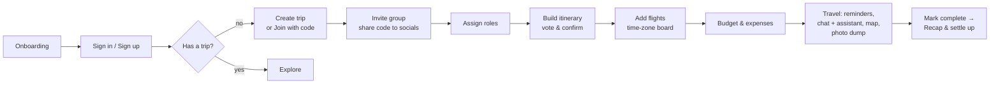
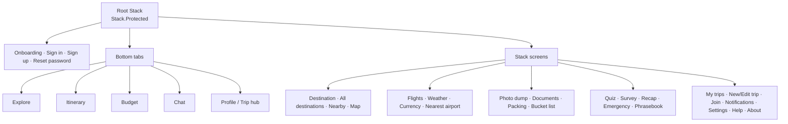
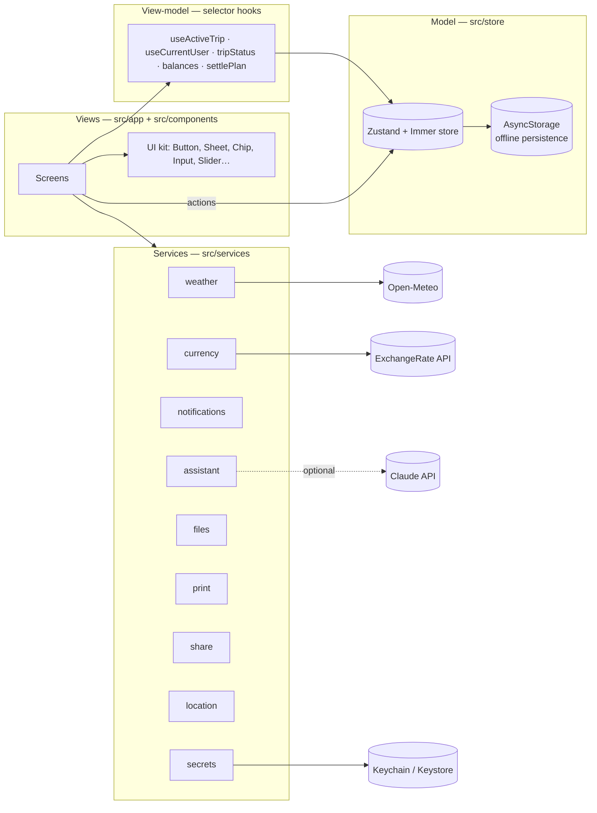
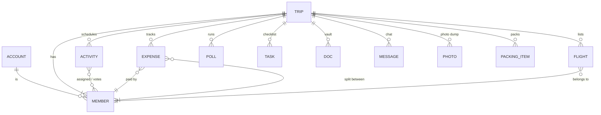

# TogetherWeGo — Planning documents

These are the planning artifacts behind the app (rating sheet: *Planning Process — tangible planning documents*).

## 1. Problem statement
Group trips fall apart in group chats: plans live in five apps, nobody knows who paid for what, flights land at different times in different time zones, and the one person with the booking PDF has no signal. **TogetherWeGo puts the whole trip — plan, money, people and paperwork — in one shared place that still works offline.**

## 2. Personas
| Persona | Needs | Features that serve them |
|---|---|---|
| **Maya, 17 — the organizer** | Get six friends to agree, keep everyone on schedule | Invite codes, roles, polls & activity voting, live reminders, printable planner |
| **Priya, 17 — the treasurer** | Track a shared budget fairly, settle up without awkwardness | Budget cap, multi-currency expenses, splits, fewest-payment settle-up |
| **Diego, 16 — the foodie** | Find great food nearby within budget | Nearby radius + price filter, budget finds, Trip Assistant “best food nearby?” |
| **Mr. Kim — a parent chaperone** | Know where everyone is, keep documents & emergency info handy | Flights & arrivals board, offline document vault, emergency numbers, location sharing |

## 3. User journey

## 4. Navigation map

## 5. Architecture

## 6. Data model

Key decisions:
- **Dates vs. instants.** Itinerary times are wall-clock times in the destination’s zone (`2026-10-06` + `14:30`), because that is how people plan. Flights are stored as UTC instants so they convert correctly to any time zone.
- **Money in one base currency.** Expenses are stored in USD (with the original amount kept) so totals and splits are always comparable; views convert to home or local currency.
- **Majority voting.** A “voting” activity becomes “confirmed” when more than half of members vote yes.

## 7. Feature priorities (MoSCoW)
| Must | Should | Could | Won’t (this version) |
|---|---|---|---|
| Trips + invite codes, roles, itinerary, voting, budget & splits, chat, flights & time zones, reminders, offline storage, validation | AI assistant, currency converter, weather, documents vault, map, nearby radius & filters, printable planner, social sharing | Quiz, survey recommendations, phrasebook TTS, recap, packing suggestions, emergency screen, 6 languages | Cloud sync server, real Google OAuth, payments |

## 8. Accessibility & UX rationale
- Reference-matched visual language: cream canvas, forest-green primary, soft-green highlights, pill navigation — calm and readable outdoors.
- Every icon-only control has an `accessibilityLabel`; toggles expose checked/selected state; sliders are adjustable with screen readers.
- Text size setting (Default / Large / Extra large) on top of the phone’s own font scaling.
- Errors appear inline under the field in red with a plain-language fix (“Codes look like ABC-1234”).
- Destructive actions always confirm; toasts confirm every successful action.

## 9. Test log (manual + automated browser run)
| Area | Checks |
|---|---|
| Auth | Empty-field errors, wrong password, sign-up validation & strength meter, reset-code flow, old password rejected after reset |
| Itinerary | Add-activity validation, overlap warning, vote → auto-confirm, reminder toggle, edit, delete, category filter |
| Budget | Amount validation, ¥ expense converted to USD, settle-up records payment, budget-cap validation |
| Collaboration | Join with empty/unknown/valid code, add-member validation (name, email), polls (vote, close), checklist add + empty-task error |
| Flights | Missing-field errors, unknown IATA rejected, flight saved, time-zone toggle |
| Platform | `tsc --noEmit` (strict) ✔, `expo lint` 0 problems ✔, `expo-doctor` 21/21 ✔, iOS + Android bundles compile ✔ |
